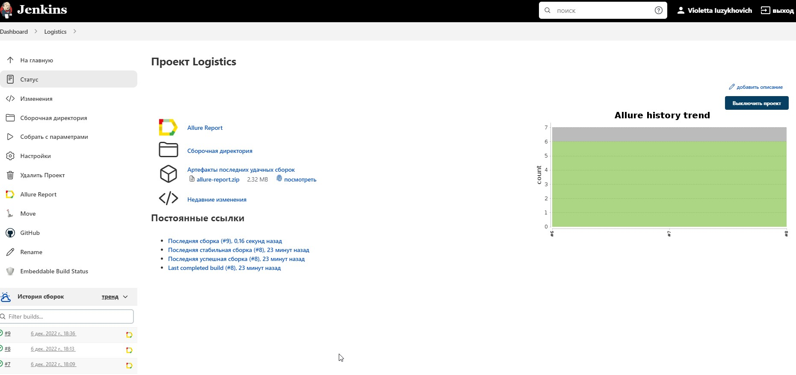
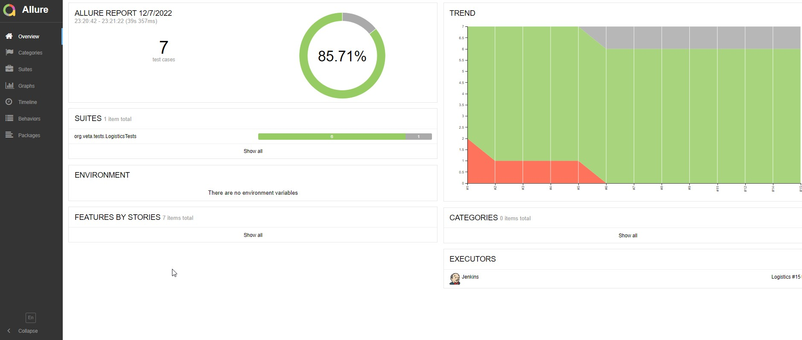
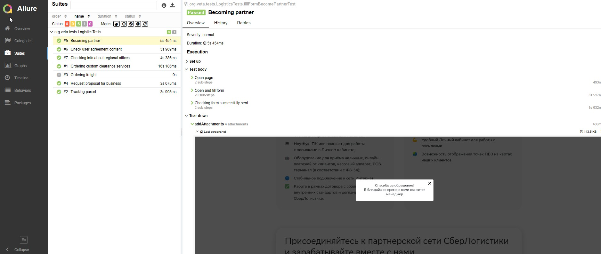
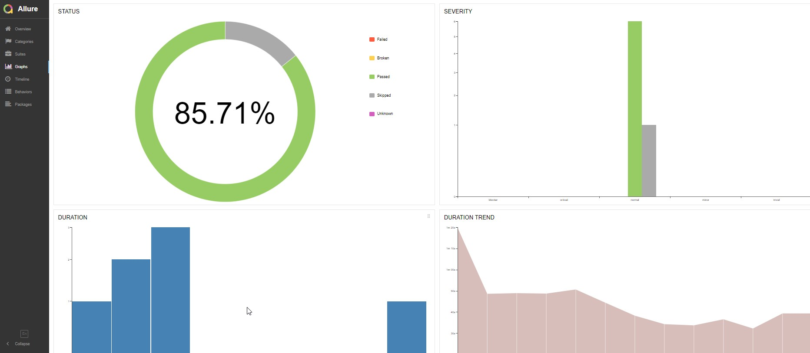
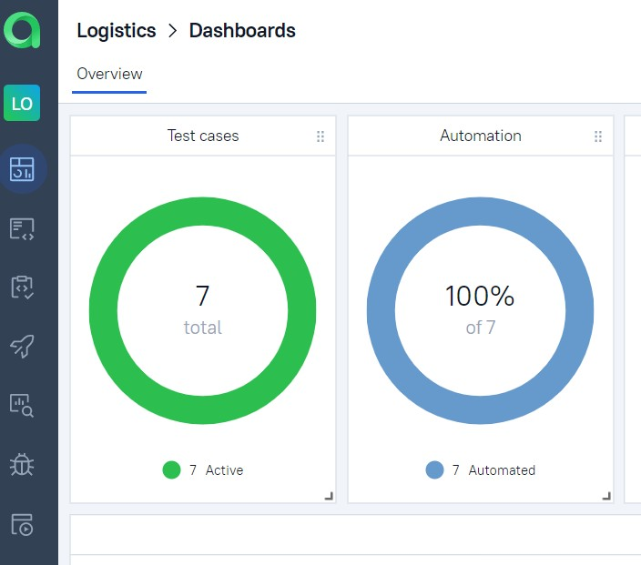
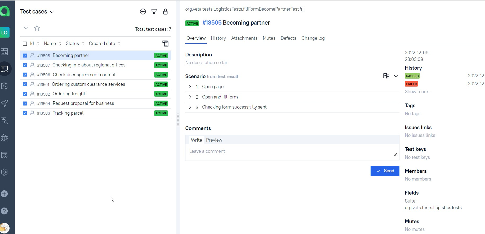
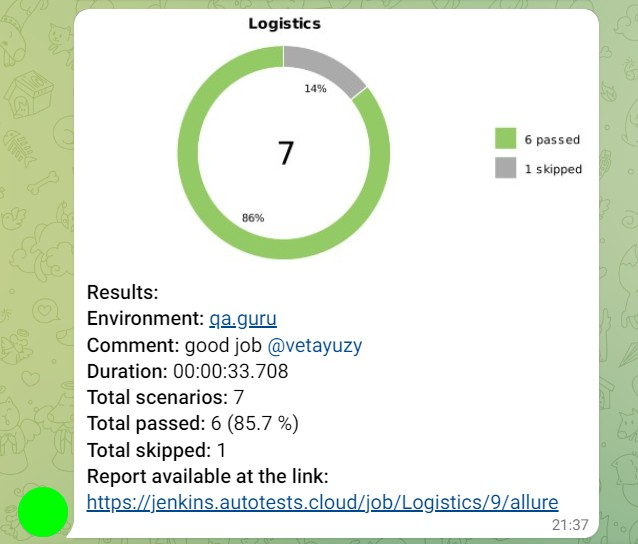

# Проект по автоматизации тестирования сайта Сберлогистика 
<p align="left">
 
</p>

<a target="_blank" href="https://sberlogistics.ru/">sberlogistics.ru</a>
## :white_square_button: Содержание:

- [Технологии и инструменты](#earth_africa-технологии-и-инструменты)
- [Реализованные проверки](#earth_africa-Реализованные-проверки)
- [Сборка в Jenkins](#earth_africa-Jenkins-job)
- [Allure отчет](#earth_africa-Allure-отчет)
- [Интеграция с Allure TestOps](#earth_africa-Интеграция-с-Allure-TestOps)
- [Уведомление в Telegram](#earth_africa-Уведомление-в-Telegram-при-помощи-бота)
- [Видео прохождения тестов](#earth_africa-Примеры-видео-о-прохождении-тестов)

## :white_square_button: Технологии и инструменты

<p align="center">
<a href="https://www.jetbrains.com/idea/"></a>
<a href="https://www.java.com/"></a>
<a href="https://github.com/"></a>
<a href="https://junit.org/junit5/"></a>
<a href="https://gradle.org/"></a>
<a href="https://selenide.org/"></a>
<a href="https://aerokube.com/selenoid/"></a>
<a href="https://github.com/allure-framework/allure2"></a>
<a href="https://www.jenkins.io/"></a>
</p>

## :white_square_button: Реализованные проверки

- ✓ Проверка отправки формы заказа услуг по таможенному оформлению;
- ✓ Проверка отслеживания статуса отправлений;
- ✓ Проверка отправки формы запроса сотрудничества;
- ✓ Проверка отправки формы "Стать партнером";
- ✓ Проверка корректности содержания опубликованного пользователького соглашения;
- ✓ Проверка информации в разделе "Региональные офисы";
- ✓ Проверка отправки формы "Оформить доставку".


## </a> Jenkins job
<a target="_blank" href="https://jenkins.autotests.cloud/job/Logistics/">Сборка в Jenkins</a>
<p align="center">
<a href="https://jenkins.autotests.cloud/job/Logistics/"></a>
</p>

### Параметры сборки в Jenkins:

- browser (браузер, по умолчанию chrome)
- browserVersion (версия браузера)
- browserSize (размер окна браузера, по умолчанию 1920x1080)
- remoteDriverUrl (логин, пароль и адрес удаленного сервера selenoid)
- videoStorage (адрес, по которому можно получить видео)


## :white_square_button: Запуск тестов из терминала

Локальный запуск:
```bash
gradle clean test
```

## :white_square_button: Удаленный запуск:
```bash
clean
test
-Dbrowser=${BROWSER}
-DbrowserVersion=${BROWSER_VERSION}
-DbrowserSize=${BROWSER_SIZE}
-DremoteDriverUrl=https://${LOGIN}:${PASSWORD}@${REMOTE_DRIVER_URL}/wd/hub/
-DvideoStorage=https://${REMOTE_DRIVER_URL}/video/
```

## </a> Отчет в <a target="_blank" href="https://jenkins.autotests.cloud/job/Logistics/allure/">Allure report</a>

### Основное окно

<p align="center">

</p>

### Тесты

<p align="center">

</p>

### Графики прохождения тестов

<p align="center">

</p>

## </a>Интеграция с Allure TestOps

### Дашборд

<p align="center">

</p>

### Тест-кейсы

<p align="center">

</p>

## </a> Уведомление в Telegram с результатами тестов

<p align="center">

</p>


### </a> Видео прохождения тестов

<p align="center">
 </p>
